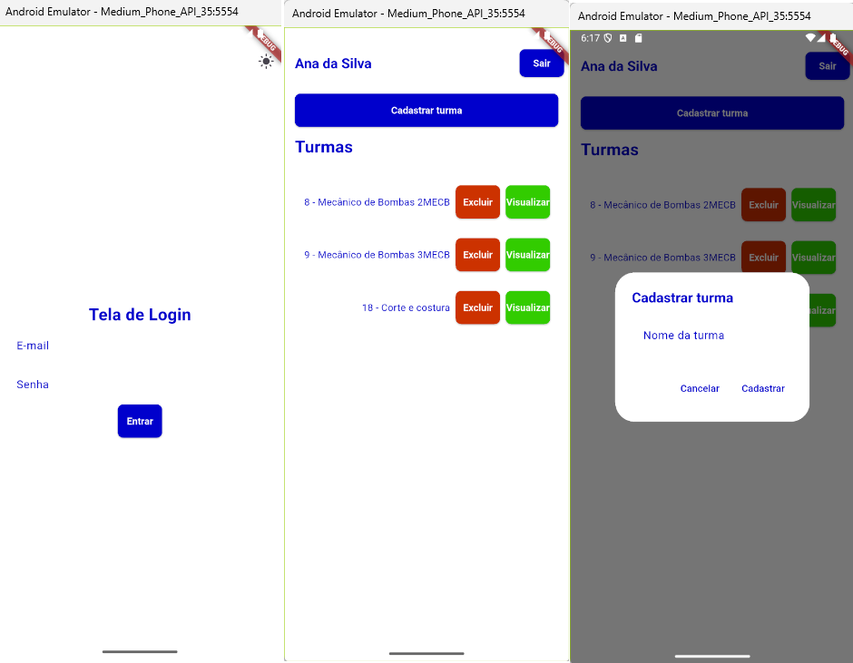
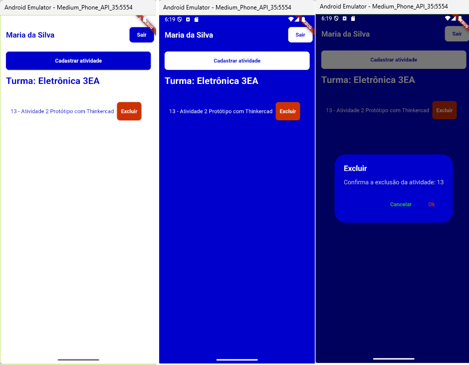

# Escola Flutter

App de Gestão de atividades escolares, resolução da avaliação SAEP de 2023 no curso Técnico em Desenvolvimento de Sistemas.
<br>A Avaliação foi web full-stack, porém resolvemos também na versão mobile.

## Passos para testar
- 0 Será necessário executar a [API](https://github.com/wellifabio/escola-shadcn-2025.git) localmente e alterar o endereço **IPv4** na **baseUrl** do arquivo `./lib/_root/api.dart` para o seu IP local `ipconfig`:
```dart
abstract class Api {
  static const String baseUrl = 'http://192.168.0.102:3000';
  static const String loginEndpoint = '/login';
  static const String turmaEndpoint = '/turma';
  static const String atividadeEndpoint = '/atividade';
}
```
- 1 Clonar este repositório
- 2 Abrir com VsCode ou Android Studio e em um terminal `CMD` ou `bash` instalar as dependências
```bash
flutter pub get
```
- 3 Executar
```
flutter run
```
Obs: Escolha um emulador ou navegador web, a API cadastra alguns usuários no banco de dados, você pode usar o seguinte para testar:
```
email: ana@email.com
senha: senha123
```
## Funcionalidades
- Splash Screen
- Consumo de REST API com Flutter
- Tema Claro e Escuro
- Login e navegação
- Passagem de parâmetros entre telas via (SharedPreferences)

## Screenshots

